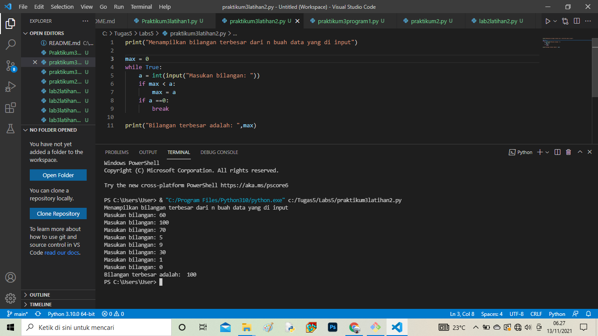
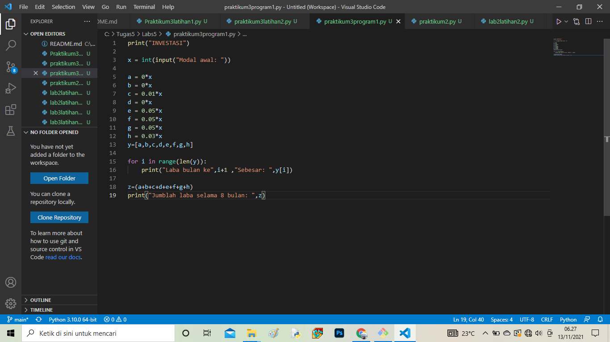
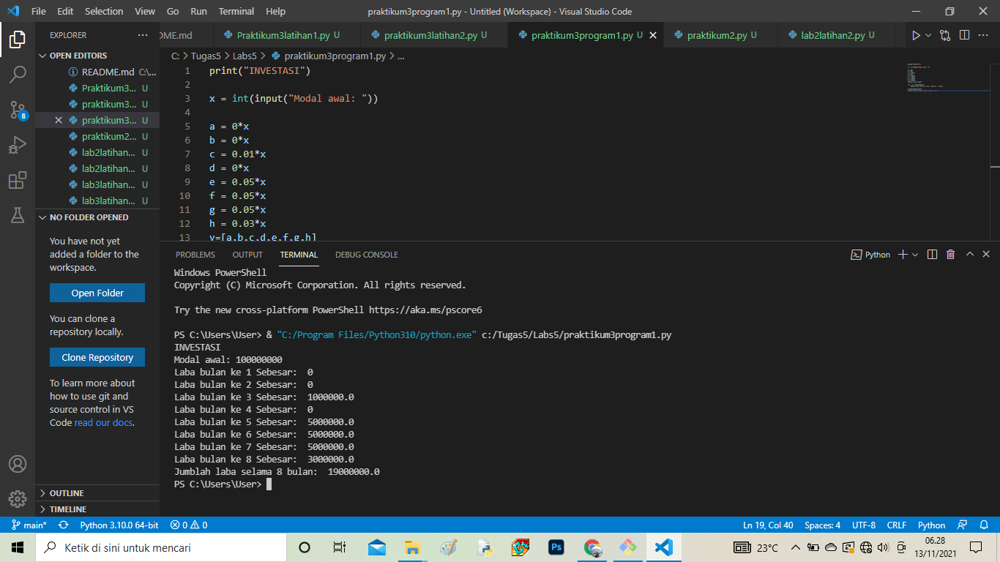
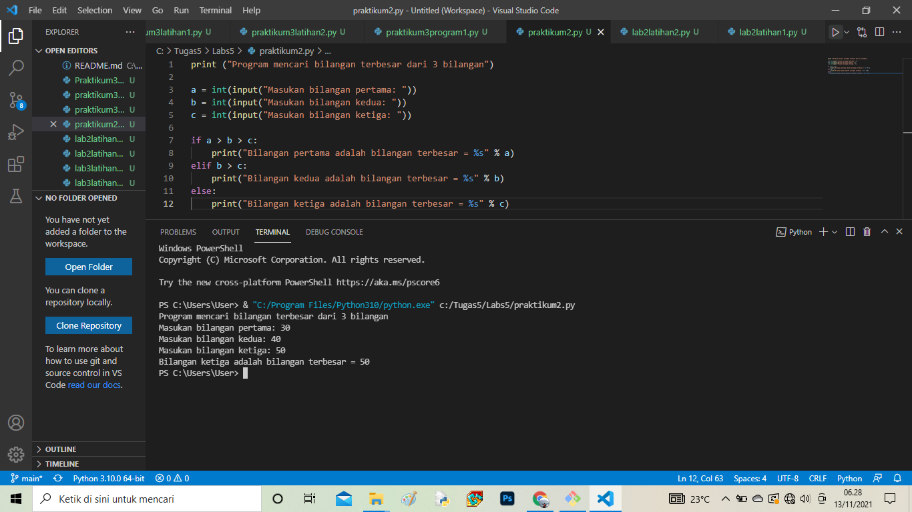
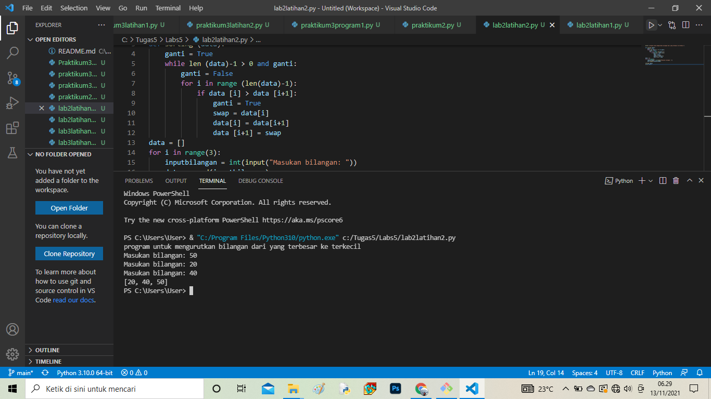
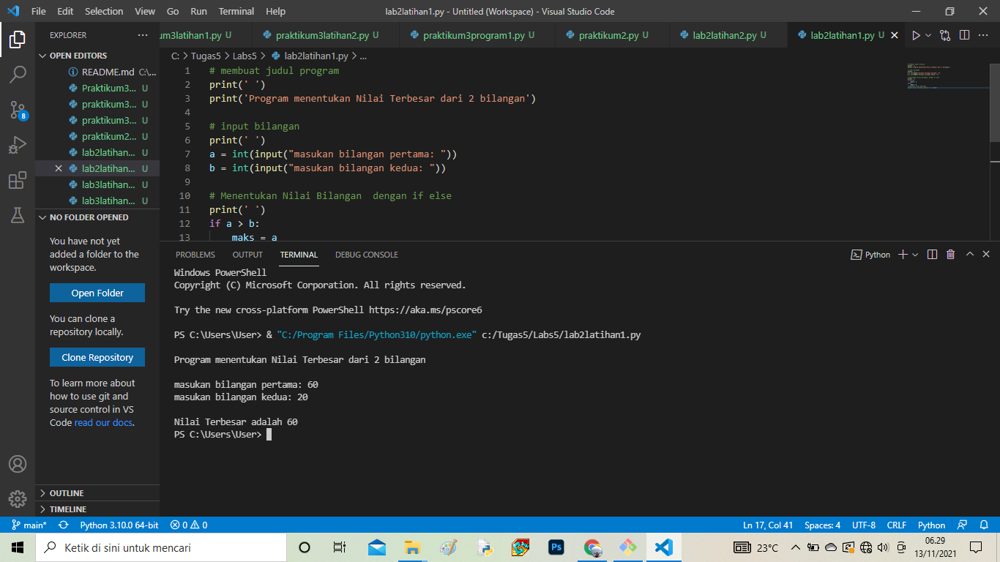
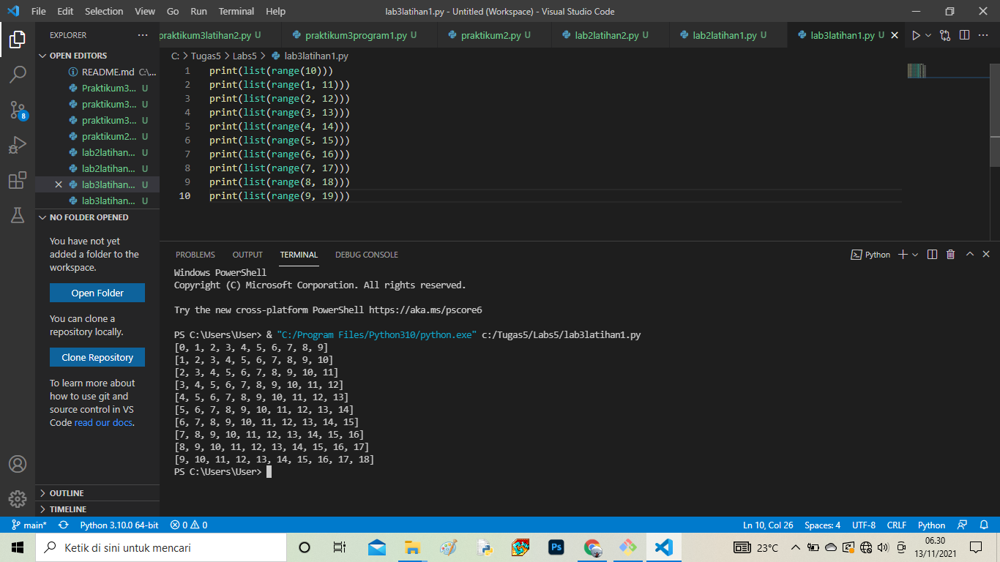
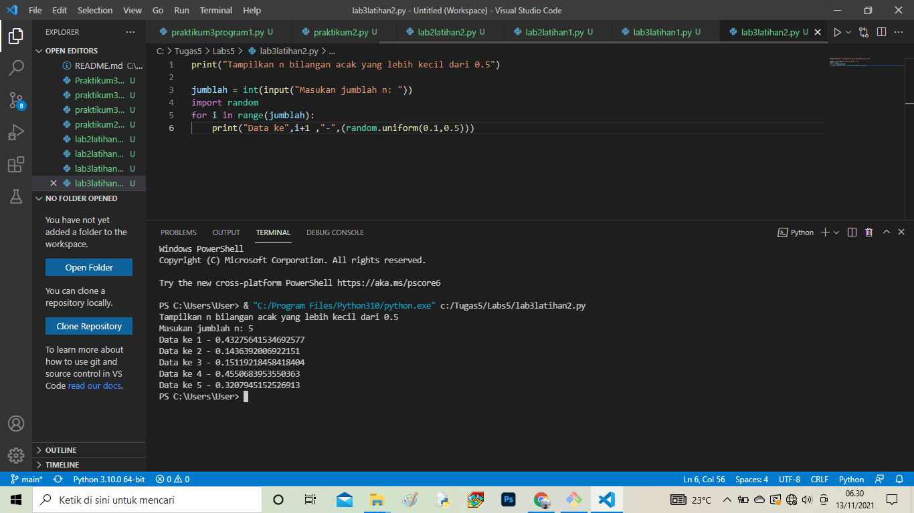

Nama : Zainal abidin
Kelas : TI.C1.21
NIM : 312110105

# Labs5

## Praktikum 3 latihan 1
print("Tampilkan n bilangan acak yang lebih kecil dari 0.5") - adalah perintah untuk menampilkan judulnya.
jumlah = int(input("Masukkan jumlah n: ")) - adalah perintah untuk menginput nilai n tersebut
import random - adalah perintah untuk mengadopsi built-in random yang telah tersedia di python
for i in range(jumlah): - adalah perintah untuk i sebagai integer dalam baris jumlah
print("data ke", i+1,"=",(random.uniform(0.1,0.5))) - adalah perintah untuk menampilkan hasil yang telah di input dengan ketentuan random uniform mulai dari nilai 0.1 sampai 0.5

### Praktikum 3 latihan 2
print("Menampilkan bilangan terbesar dari n buah data yang di input") - adalah perintah untuk menampilkan program judul
max = 0 - adalah perintah untuk menampilkan nilai max yang adalah 0
while True: - adalah perintah untuk mundur hingga waktu yang tidak ditentukan
a = int(input("Masukkan Bilangan: ")) - adalah perintah untuk menginput nilai integer
if max < a: - adalah perintah untuk tipe data if atau jika, maksimal nilai lebih kecil dari a atau integer
max = a - perintah untuk nilai maximal sama dengan a atau integer
if a ==0: - perintah untuk tipe data if atau jika a sama dengan 0 maka
break - perintah untuk mengakhiri pengulangan, jadi jika menginput nilai 0 maka pengulangan berakhir atau selesai

#### Praktikum 3 perogram 1
print("Investasi") - adalah untuk menampilkan judul
x = int(input("Modal: ")) - adalah untuk menginput nilai x sebagai modal awal
a = 0*x - a adalah bulan pertama, karena bulan pertama belum memiliki laba, jadi masih 0 dikali dengan x nilai uang modal awal
b = 0*x - b adalah bulan kedua, karena bulan kedua belum memiliki laba, jadi nilai x dari uang modal dikali dengan 0
c = 0,01*x - c adalah bulan ketiga, dan sudah memiliki laba 1%, jadi ditulis 0,01 bentuk sederhana dari 1% dikali dengan modal atau uang awal dengan nilai x
d = 0,01*x - d adalah bulan keempat, dan labanya 1%, jadi ditulis 0,01 dikalikan dengan nilai x yang adalah uang awal atau modal
e = 0,05*x - e adalah bulan kelima, dan laba pada bulan kelima sebesar 5%, maka ditulis 0,05 dikalikan dengan nilai x untuk nilai uang awal atau modal
f = 0.05*x - f adalah bulan jasa, dan laba pada bulan sebesar 5%, maka ditulis 0.05 dikalikan dengan nilai x untuk nilai uang awal atau modal
g = 0.05*x - g adalah bulan ketujuh, dan laba pada bulan ketujuh sebesar 5%, maka ditulis 0.05 dikalikan dengan nilai x untuk nilai uang awal atau modal
h = 0,02*x - h adalah bulan kedelapan, dan laba pada bulan kedelapan sebesar 2%, maka ditulis 0,02 dengan nilai x untuk nilai uang awal atau modal
y=[a,b,c,d,e,f,g,h] - adalah untuk menentukan syarat y yang berisi a,b,c,d,e,f,g,h
untuk i dalam rentang(len(y)): - adalah untuk perulangan data dengan isi data y, dengan menampilkan urutan laba perbulan sesuai rentang yang ditentukan dengan hasil ke urutan yang diinputkan dari data y
print("Laba Bulan Ke",i+1 ,"sebesar: ",y[i]) - untuk menampilkan hasil laba dari bulan ke 1 sampai terakhir
z=(a+b+c+d+e+f+g+h) - Z untuk data yang berisi hasil penjumlahan laba dari bulan pertama sampai bulan ke delapan
print("Jumlah Laba Selama 8 Bulan: ",z) - menampilkan hasil dari jumlah

##### Praktikum 2
Menggunakan statement if untuk mencari nilai terbesar dari 3 bilangan
untuk mencari bilangan terbesar dari 3 bilangan algoritmanya yang dimasukkan akan membandingkan terlebih dahulu apakah a>b.
jika a>b,maka ada 2 kadidat bilangan terbesar,yaitu a dan c sehingga perlu dilakukan pengujian yang lebih besar dari a dan c dengan membandingkan nilai b dan c. jika nilai b ternyata lebih besar dari c, maka bilangan terbesar adalah a.
jika kondisi a>b tidak terpenuhui(atau b<=a),maka 2 kadidat bilangan terbesar adalah b dan c.jika nilai c ternyata lebih kecil dari a,maka b adalah nilai terbesar,sedangakan jika c yang lebih besar dari b ,maka yang terbesar adalah c.

# Lab 2 latihan 1
Buat program untuk mengurutkan data berdasarkan input sejumlah data (minimal 3 input variabel atau lebih), kemudian ditampilkan hasilnya secara berurutan mulai dari data terkecil.

# Lab 2 latihan 2
Buat program sederhada dengan memasukkan 2 buah bilangan, kemudian tentukan bilangan terbesar dari kedua bilangan tersebut menggunakan pernyataan if

# Lab 3 latihan 1
Buat program dengan perulangan bertingkat untuk menghasilkan output sebagai berikut:

# Lab 3 latihan 2
print("Tampilkan n bilangan acak yang lebih kecil dari 0.5") - adalah perintah untuk menampilkan judulnya.
jumlah = int(input("Masukkan jumlah n: ")) - adalah perintah untuk menginput nilai n tersebut
import random - adalah perintah untuk mengadopsi built-in random yang telah tersedia di python
for i in range(jumlah): - adalah perintah untuk i sebagai integer dalam baris jumlah
print("data ke", i+1,"=",(random.uniform(0.1,0.5))) - adalah perintah untuk menampilkan hasil yang telah di input dengan ketentuan random uniform mulai dari nilai 0.1 sampai 0.5
